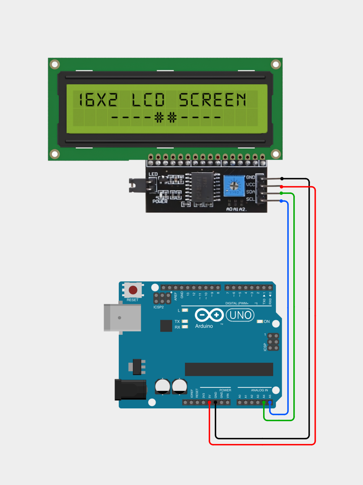

# labscreen

An addon for a Linux device intended for homelabs that displays relevant system information on a small display controlled by an Arduino.

## Parts needed
1. Arduino board with a 5V pin
2. Data-capable USB-to-Arduino cable (any cable you'd normally use to upload sketches will do — it stays connected permanently after setup, since it also carries the serial data)
3. 2x16 char LCD display with I2C capability (LCD1602 I2C)
4. 4x female-to-male jumper wires (female end connects to the LCD module's pins, male end connects to the Arduino's pins)

## Requirements
Install arduino-cli:
```bash
curl -fsSL https://raw.githubusercontent.com/arduino/arduino-cli/master/install.sh | sh
```

Install the AVR core:
```bash
arduino-cli core update-index
arduino-cli core install arduino:avr
```

Install the LiquidCrystal I2C library:
```bash
arduino-cli lib install "LiquidCrystal I2C"
```

## Physical setup


1. Attach the wires to your Arduino board and LCD1602 according to the diagram above.
2. Connect your Arduino board to your Linux device using the data-capable USB cable.

## Installation

1. Open a bash terminal on the Linux device the Arduino board is connected to.

2. Clone the repository to a temporary path:
   ```bash
   git clone https://github.com/WombatOfCombat/labscreen /tmp/labscreen
   ```

3. Find your Arduino board's stable device path:
   ```bash
   ls -l /dev/serial/by-id/
   ```
   It will look something like:
   ```
   usb-Arduino__www.arduino.cc__0043_XXXXXXXXXXXX-if00
   ```

4. Edit `lcd-stats.sh` and set `SERIAL_DEV` (line 12) to the full path you found above:
   ```bash
   nano /tmp/labscreen/lcd-stats.sh
   ```
   ```
   SERIAL_DEV="/dev/serial/by-id/<paste-path-here>"
   ```
   > **Note:** This is currently a manual step. If you'd rather not hardcode the path, you can replace this line with an auto-detect one-liner such as:
   > ```bash
   > SERIAL_DEV=$(ls /dev/serial/by-id/usb-Arduino* 2>/dev/null | head -n1)
   > ```
   > This picks the first attached Arduino automatically, which is fine for a single-board setup but should be pinned manually if you have more than one Arduino connected.

5. Flash the Arduino with `lcd_stats_display.ino`:
   ```bash
   arduino-cli upload -p <stable path to arduino> --fqbn arduino:avr:uno /tmp/labscreen/lcd_stats_display
   ```
   The display should turn off, then back on, then show "Waiting for lcd-stats...".

6. Move the `.service` and `.sh` files into place and start the service:
   ```bash
   cp /tmp/labscreen/lcd-stats.sh /usr/local/bin/
   chmod +x /usr/local/bin/lcd-stats.sh
   cp /tmp/labscreen/lcd-stats.service /etc/systemd/system/
   systemctl daemon-reload
   systemctl enable --now lcd-stats
   ```
   Within 5 seconds, the Arduino screen should begin displaying stats.

7. Clean up the temporary files:
   ```bash
   rm -rf /tmp/labscreen
   ```
